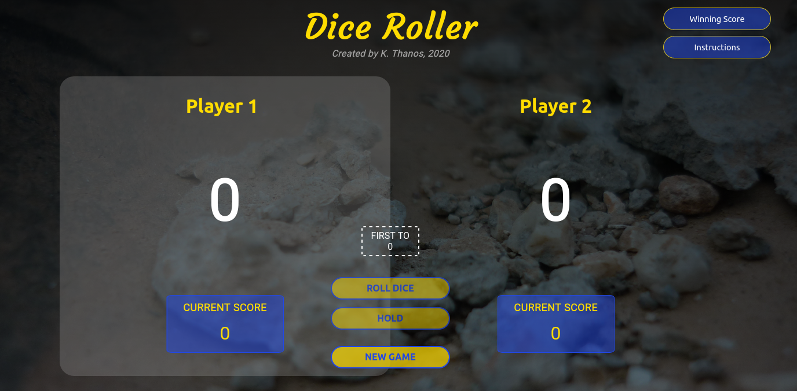
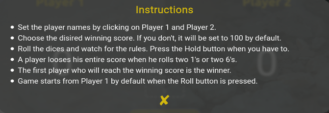
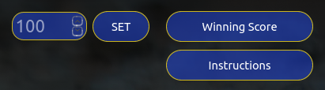
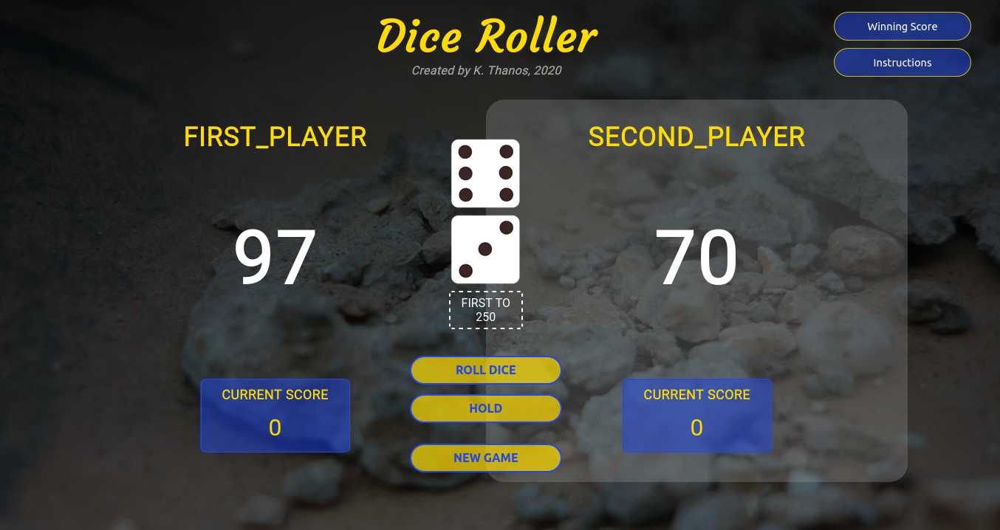
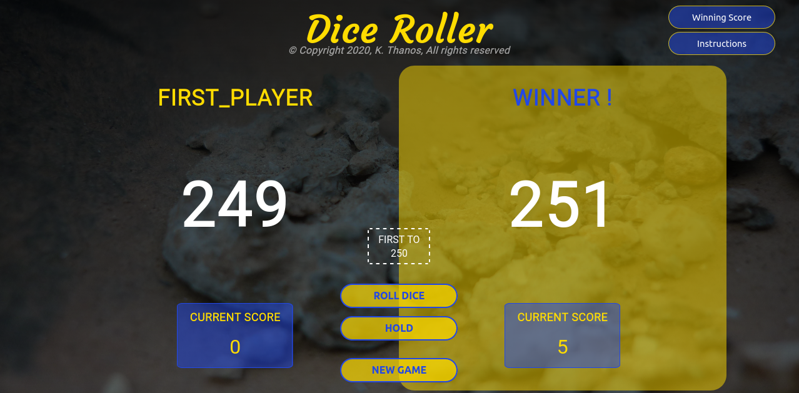
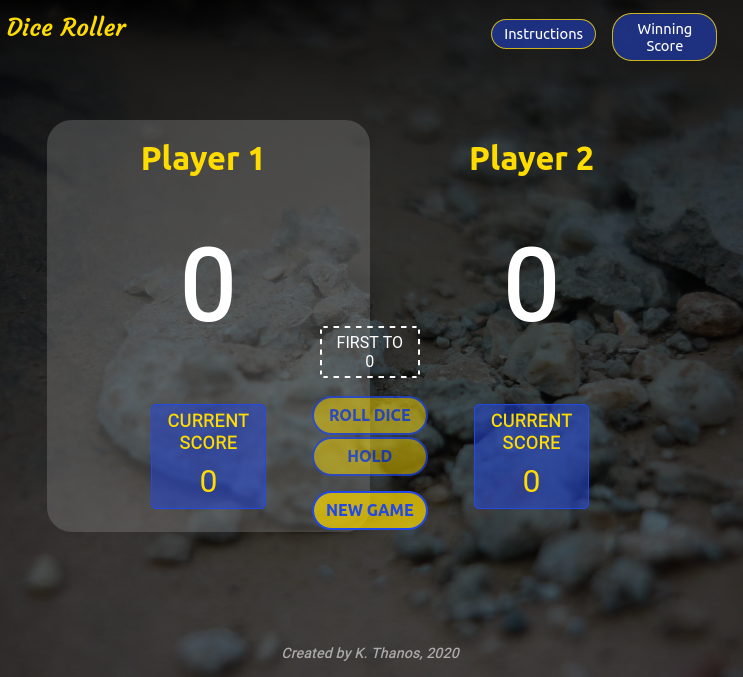
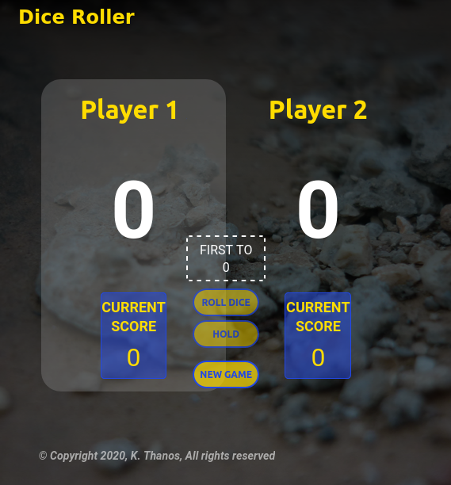

# Dice Roller Game

### Dice Roller it's a two player game with dices
Watch the game in action on this video : [Dice Roller Game](https://www.youtube.com/watch?v=AiqHsKFflec)

[](https://www.youtube.com/watch?v=AiqHsKFflec "Dice Roller Game")

Looking at the picture below (mainpage of the game) there are some options which the two players should adjust.  

<p align="center">
   
</p>

1. #### Read the game instructions which can be found by pressing the second button (*Instructions*) on the top right.  

   ```
     a. Set the player names by clicking on Player 1 and Player 2.
     b. Choose the disired winning score. If you don't, it will be set to 100 by default.
     c. Roll the dices and watch for the rules. Press the Hold button when you have to.
     d. A player looses his entire score when he rolls two 1's or two 6's.
     e. The first player who will reach the winning score is the winner.
     f. Game starts from Player 1 by default when the Roll button is pressed.
   ```
<p align="center">
  
</p>

2. #### Set their names on Player1 and Player2 respectively by clicking on them.

3. #### Choose the disired score by pressing the first button (*Winning Score*) on the top right. If the players don't set a score, then the score will be set to 100 by default.  
   <p align="center">
      
   </p>

4. #### Game starts from Player1 by default when the **ROLL DICE** button is pressed.  

5. #### The active player has a gray background. This player rolls the dice and continues to roll until the desired winning score is reached. If he rolls two 1's or two 6's then he loses his turn and at the same time loses the score he has won so far. To avoid this, he should press the **HOLD** button and hold the current score.  


5. #### The first player who will reach the winning score is the winner.  

Below are 2 photos. One is during the game and the other one is when Player1 has already won.
<p align="center">
  
  
</p>

If the screen is smaller or user wants to make it smaller then the mainpage takes some of the following forms.  
<p align="center">
  
  
</p>

Watch the game in action on this video : [Dice Roller Game](https://www.youtube.com/watch?v=AiqHsKFflec)

## Author
* **Konstantinos Thanos**
